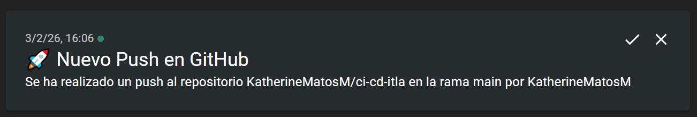

# Práctica de Integración Continua con GitHub Actions

Este proyecto demuestra la implementación de integración continua usando GitHub Actions para enviar notificaciones automáticas a ntfy.sh cuando se realiza un push a la rama main.

## Descripción

Proyecto simple de Hola Mundo en JavaScript que implementa un workflow de GitHub Actions para notificaciones automáticas.

## Funcionamiento

Cada vez que se realiza un push a la rama main, GitHub Actions:

1. Se activa automáticamente
2. Ejecuta el workflow configurado
3. Envía una notificación a ntfy.sh/devops-itla con información del push

## Tecnologías Utilizadas

- JavaScript
- GitHub Actions
- ntfy.sh para notificaciones

## Notificaciones

Las notificaciones se pueden visualizar en: https://ntfy.sh/devops-itla